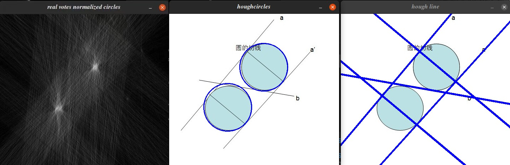

# Computer Vision & Robotics Projects

This repository is a collection of C++ projects demonstrating fundamental digital image processing (DIP) and computer vision algorithms. A key focus is the **implementation of these algorithms from scratch** to showcase their underlying mechanics. Most projects are integrated with the **Robot Operating System (ROS)**, linking perception algorithms directly to robotics applications like navigation and object tracking.

## Algorithms Implemented from Scratch

This collection emphasizes a deep, practical understanding of computer vision by building core functions from first principles, rather than relying on single-line library calls. The custom-implemented algorithms include:

* **Color & Contrast**:
    * Histogram Equalization (manual histogram, CDF, and pixel remapping)
    * RGB to HSI Color Space Conversion
    * RGB to HSV Color Space Conversion
* **Filtering & Morphology**:
    * Gaussian Kernel Generation
    * Gaussian Blur
    * Morphological Erosion
    * Morphological Dilation
* **Feature & Edge Detection**:
    * Sobel Operator
    * Canny Edge Detector (including Non-Maximum Suppression and Hysteresis)
    * Hough Transform for Lines
    * Hough Transform for Circles

> [!NOTE]
> You may need to first build packages in the `dashgo` folder.

## Projects Structure

* `LegTracker`: **Human Following Robot**
    * An applied project that uses color segmentation and a unique top-down search to enable a robot to follow a person's legs.
* `DIP_EXPERIMENT_1`: **Histogram Equalization**
    * A demonstration of from-scratch histogram equalization to enhance image contrast.
* `DIP_EXPERIMENT_2`: **Spatial & Morphological Filtering**
    * Implements Gaussian blur, erosion, and dilation operations from scratch.
* `DIP_EXPERIMENT_3`: **Feature Detection**
    * Implements the Canny edge detector and Hough transform for lines and circles from scratch.
* `DIP_EXPERIMENT_4`: **Color-Based Robot Control**
    * Implements color space conversion and uses color detection to control a robot.

---

## LegTracker: Human Following Robot

This is a ROS-integrated computer vision project written in C++ that enables a robot to track and follow human legs. 🤖 The core application uses color segmentation to identify a person's legs (e.g., by the color of their pants) in a live camera feed. It then analyzes the position and size of the legs to generate real-time motion commands, creating a "follow-me" behavior for a mobile robot. The various `LegTracker*.cpp` files represent different configurations and versions of this same system.

### Core Perception Strategy

The project's most unique feature is its method for robustly identifying the two legs against a noisy background.

* **Color-Based Segmentation**: The system first converts the camera image from BGR to the **HSV (Hue, Saturation, Value)** color space, which is ideal for color tracking. The application includes interactive trackbars that allow a user to dynamically tune the H, S, and V ranges to isolate the specific color of the target's legs.
* **Iterative Top-Down Search**: Instead of analyzing the entire image at once, the `colorseg` function employs a unique top-down iterative search. It progressively analyzes smaller horizontal slices of the image from the top, a strategy designed to find the subject while ignoring potential noise on the floor.
* **Contour Analysis**: Within each image slice, the code performs a standard object detection pipeline: a **morphological opening** cleans the binary image, `findContours` detects colored blobs, and `minAreaRect` fits a rectangle to each. The code then identifies the **two largest rectangles**, assuming these correspond to the two legs.

### Robot Control Logic

Once the legs are detected, their position and size are translated into robot motion commands.

* **Target Estimation**: The application calculates the center point (`midpoint`) between the two detected leg-rectangles to serve as the robot's tracking target.
* **Proportional Control**: The robot's movement is determined by a simple proportional control scheme:
    * **Angular Velocity (Turning)** is proportional to the horizontal error between the `midpoint` and the center of the camera frame.
    * **Linear Velocity (Forward/Backward)** is proportional to the error between the detected area of the legs and a desired target area, creating a distance-keeping behavior.
* **ROS Integration**: The calculated velocities are packaged into a `geometry_msgs/Twist` message and published to a standard ROS topic to control the robot.

### Project Variants

The different source files represent various configurations of the same system:
* Some versions are configured for a standard **monocular camera** by processing the full image frame.
* Other versions are set up for a **stereo camera** but only use the left half of the video feed.
* The `LegTracker_no_robot.cpp` version is intended for safe testing, as the command to publish motor commands is commented out. Other versions have this command active for controlling a physical robot.
* The files also contain slightly different tuning parameters and formulas for calculating the final robot velocities.

---

## DIP_EXPERIMENT_1: Histogram Equalization

This application captures video frames from a camera, converts them to grayscale, and then applies a manually coded **histogram equalization** algorithm to improve image contrast. It displays both the original and the enhanced video streams side-by-side for comparison. Additionally, it generates and shows histogram plots to visualize the change in pixel intensity distribution before and after the processing.

### Core Functionality

* **Video Capture**: It uses OpenCV's `VideoCapture` to get a live video stream from a camera.
* **Image Processing**: Each video frame is first converted to **grayscale**. The program then **manually implements** the histogram equalization algorithm by calculating the pixel histogram, computing the cumulative distribution function (CDF), and remapping the image's pixel intensities to stretch the contrast.
* **Visualization**: Displays the original and equalized video streams and calls a custom `drawHist` function to create and show plots of the image's histogram before and after equalization.
* **Robot Control**: The code contains an optional section that can publish `geometry_msgs/Twist` messages to a ROS topic to control a robot.

### File Breakdown

The project is structured into three main files:

#### `his_equ.cpp` (Main Executable)
This file is the application's entry point and contains the core logic. It initializes the ROS node, contains the main `while(ros::ok())` loop, holds the manual histogram equalization algorithm, and includes the robot control publisher.

#### `drawImageHistogram.hpp` (Header File)
A C++ header file that declares the functions for creating and drawing histograms, allowing the main executable to use them.

#### `drawImageHistogram.cpp` (Helper Functions)
This file provides the implementation for the helper functions, most notably `drawHist()`, which takes pixel counts and plots the histogram on a blank image.

---

## DIP_EXPERIMENT_2: Gaussian Blur, Erosion, and Dilation

This project demonstrates how to implement fundamental computer vision filters from scratch, processing a live video stream by applying custom-written Gaussian blur, erosion, and dilation operations. 📸

### Core Functionality

* **Grayscale Conversion**: Each captured color frame is converted to a single-channel grayscale image.
* **Gaussian Blurring**: The image is blurred using a **custom-implemented** Gaussian filter to reduce noise.
* **Binarization**: The image is converted to a binary (black and white) image via thresholding.
* **Morphological Operations**: Custom `Erode` and `Dilate` functions are applied to the binary image to shrink or expand white regions.

### File Comparison

The project includes two files representing different implementation approaches:

* `spacial_filter.cpp` **(Advanced)**: Provides a robust implementation where a `GaussianKernalGenerator()` function dynamically creates the filter kernel.
* `copy.cpp` **(Basic)**: Demonstrates a simpler approach using a hardcoded 3x3 Gaussian kernel.

---

## DIP_EXPERIMENT_3: Canny Edge Detection and the Hough Transform

This project's main goal is to demonstrate the underlying mechanics of Canny edge detection and the Hough transform for finding lines and circles in images, processing static image files and showing the results of each algorithm step-by-step.

### Core Algorithms Implemented

The project's significance lies in its **from-scratch implementations** of classic computer vision algorithms:

* **Canny Edge Detector**: A complete, custom implementation (`mycanny`), including Gaussian blur, a custom Sobel operator (`mysobel`), Non-Maximum Suppression (NMS), and double thresholding with hysteresis.
* **Hough Line Transform**: The `myhough_lines` function implements the Hough transform to detect straight lines by having edge points "vote" in a parameter space.
* **Hough Circle Transform**: The `myhough_circles` function detects circles by using gradient direction to have edge points vote for potential center locations.

### Execution Flow

The `main` function orchestrates the entire feature detection pipeline:

1.  **Setup**: A ROS node named `featureDetection` is initialized.
2.  **Image Loading**: The program loads a local image file (e.g., `Lenna_(test_image).png`).
3.  **Canny Detection**: The image is converted to grayscale and passed through the custom Canny detection pipeline. Intermediate results are shown in separate windows.
4.  **Hough Transform**: The code switches to a different image more suitable for line and circle detection (e.g., `lines_and_circles.jpg`). This image's edges are then fed into the `myhough_lines` and `myhough_circles` functions, and the final results with detected features are displayed.

---

## DIP_EXPERIMENT_4: Color Space Conversion and Identification

This application's primary goal is to identify the dominant color (red, green, blue, or yellow) in the camera's view and issue corresponding navigation commands to a robot. It stands out by implementing the color space conversion algorithms **from scratch**.

### Core Algorithms and Techniques

* **From-Scratch Color Space Conversion**: The project includes custom functions `RGB_to_HSI` and `RGB_to_HSV` that manually implement the mathematical formulas to convert an image from the BGR color space.
* **Interactive Color Segmentation**: The application uses the HSV color space and provides an "HSV Adjust" window with trackbars to dynamically tune and isolate any color.
* **Contour Detection and Analysis**: After segmentation, the code uses `findContours` and `boundingRect` to find the largest colored object in the scene.

### Execution Flow and Robot Control

The main loop runs continuously to process each frame and make a control decision:

1.  **Capture and Convert**: A frame is captured and the custom `RGB_to_HSV` function converts it to the HSV color space.
2.  **Specific Color Detection**: The code runs a dedicated function, `find_color_block`, multiple times with hardcoded HSV ranges to find the largest contiguous areas of red, green, blue, and yellow.
3.  **Robot Control Logic**: The program compares the areas of the largest detected color blobs. If a blob exceeds a size threshold, it publishes a `geometry_msgs/Twist` message over ROS to control the robot:
    * **Red**: Go forward.
    * **Green**: Go backward.
    * **Blue**: Turn right while moving forward.
    * **Yellow**: Turn left while moving forward.
    If no color is dominant, the robot stops.
